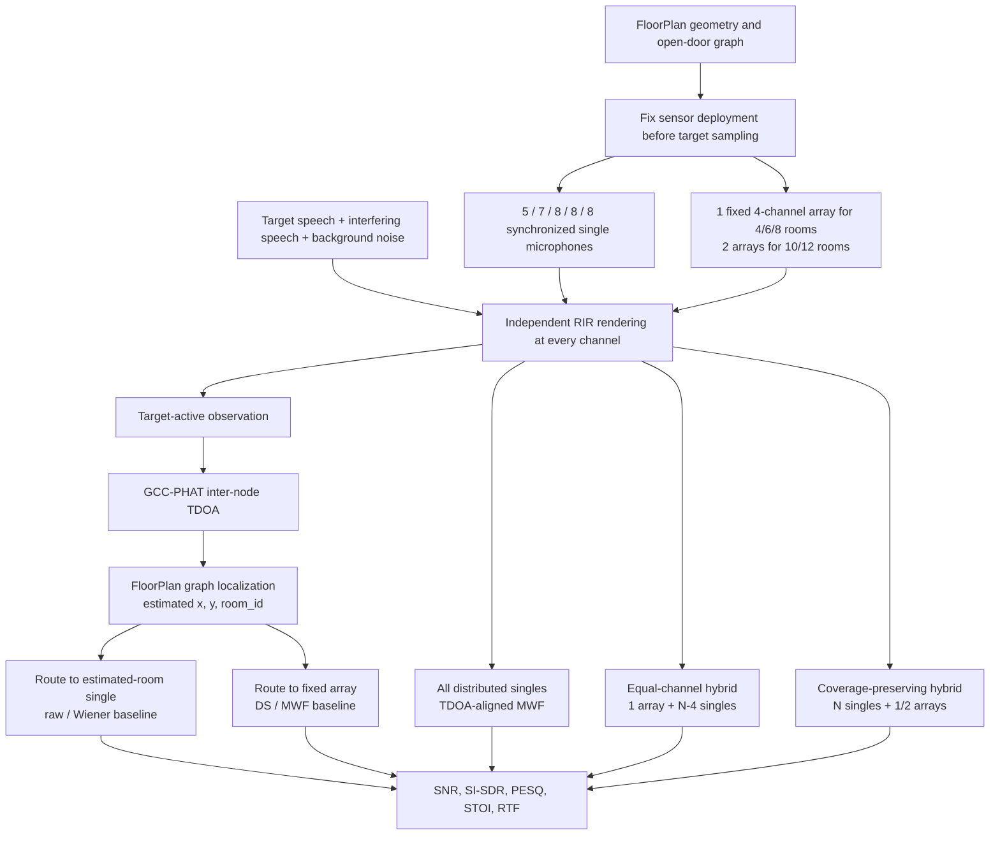

# Whole-Home Distributed Capture

Status: **complete classical baseline study**.

This study asks a deployment question rather than only an algorithm question:

> How should synchronized single microphones and compact arrays be placed in
> a home so that target-independent localization and speech enhancement remain
> useful across rooms?

The experiment is implemented entirely on Acoustic Agent FloorPlan RIRs. It
uses no neural estimator and keeps oracle systems explicitly separated from
fixed, deployable systems.

## System Flow



The coverage-preserving hybrid is a deployment rule, not a new beamforming
algorithm. It retains every topology-optimized single microphone used for
whole-home coverage and adds compact arrays only in important rooms.

## Compared Systems

| Strategy | Purpose | Fixed deployment? |
| --- | --- | --- |
| `oracle_target_room_single_raw` | Clean definition of a local single-mic pickup baseline | No; upper bound |
| `tdoa_routed_single_raw` | Select one fixed microphone using estimated `room_id` | Yes |
| `tdoa_routed_single_wiener` | Single-channel enhancement after TDOA routing | Yes |
| `oracle_target_room_array_mwf` | Four-channel array moved into the true target room | No; upper bound |
| `tdoa_routed_fixed_array_ds` | Route to the nearest appropriate fixed array, then DS | Yes |
| `tdoa_routed_fixed_array_mwf` | Route to a fixed array, then MWF | Yes |
| `distributed_singles_mwf` | TDOA-align and jointly process all distributed singles | Yes |
| `equal_channel_hybrid_mwf` | One four-channel array plus `N-4` singles | Yes |
| `coverage_hybrid_selected_mwf` | All singles deployed; process one array plus three selected singles | Yes |
| `coverage_hybrid_all_mwf` | Joint MWF over all fixed single and array channels | Yes |

The equal-channel hybrid controls the number of physical microphone capsules.
The coverage-preserving hybrid tests the practical alternative of paying for
extra array channels without removing spatially separated observation points.

## Experimental Protocol

- FloorPlans: 25 held-out layouts, five each with 4, 6, 8, 10, and 12 rooms.
- Cases: one array-covered and one array-uncovered target room per layout,
  each with same-room and cross-room interference; 100 cases total.
- Rows: 10 strategies per case; 1,000 result rows.
- Audio: 2.5 seconds, 16 kHz target speech, interfering speech, pink
  background noise, and independent sensor noise.
- RIR: `preview` quality, 1.0 second, deterministic materials and placements.
- Synchronization: ideal global sample synchronization in this baseline.
- Steering: audio GCC-PHAT TDOA for distributed channels and SRP-PHAT DOA for
  compact arrays.
- Adaptation: target-active target covariance and target-silent noise
  covariance. This is an oracle-VAD baseline, not clean-evaluation leakage.
- Level control: source gains are calibrated once at the target-room reference
  and reused at every device. Remote microphones are not independently lifted
  to the same input SNR.
- Statistics: paired comparisons and 95% confidence intervals resample whole
  FloorPlans so the four cases from one layout remain correlated.

## Deployment Policy

| Rooms | Distributed singles | Fixed circular arrays | Total channels |
| ---: | ---: | ---: | ---: |
| 4 | 5 | 1 | 9 |
| 6 | 7 | 1 | 11 |
| 8 | 8 | 1 | 12 |
| 10 | 8 | 2 | 16 |
| 12 | 8 | 2 | 16 |

Single microphones are placed with the topology-greedy FloorPlan coverage
objective. Arrays use the array placement objective and are constrained to
distinct room-center candidates. No sensor position depends on the sampled
target.

## Results

| Strategy | Mean devices | Mean channels | SI-SDR change | PESQ | P10 PESQ | STOI |
| --- | ---: | ---: | ---: | ---: | ---: | ---: |
| TDOA-routed single, raw | 7.2 | 7.2 | 0.000 dB | 1.056 | 1.044 | 0.562 |
| Distributed singles MWF | 7.2 | 7.2 | +8.517 dB | 1.370 | 1.140 | 0.740 |
| Equal-channel hybrid MWF | 4.2 | 7.2 | +10.117 dB | 1.499 | 1.062 | 0.677 |
| TDOA-routed fixed array MWF | 8.6 | 12.8 | +13.721 dB | 1.652 | 1.048 | 0.620 |
| Coverage hybrid, selected MWF | 8.6 | 12.8 | +11.880 dB | 1.785 | 1.159 | 0.813 |
| Coverage hybrid, all-channel MWF | 8.6 | 12.8 | **+13.046 dB** | **1.907** | **1.186** | **0.841** |
| Oracle target-room array MWF | 1.0 | 4.0 | +15.254 dB | 2.118 | 1.598 | 0.923 |

Relative to distributed-singles MWF, the all-channel coverage hybrid gains:

- `+0.537 PESQ`, 95% CI `[+0.444, +0.630]`, with a 91% case win rate;
- `+0.101 STOI`, 95% CI `[+0.082, +0.119]`, with a 90% case win rate;
- `+4.529 dB SI-SDR`, 95% CI `[+3.741, +5.315]`, with a 96% case win rate.

The equal-channel hybrid improves mean PESQ and SI-SDR but reduces mean STOI
by `0.064` and wins only 38-53% of cases. Replacing four spatial nodes with one
compact array loses too much whole-home coverage.

## Coverage Finding

For array-covered targets, the coverage hybrid reaches `2.422 PESQ` and
`0.938 STOI`. For array-uncovered targets it reaches `1.392 PESQ` and
`0.744 STOI`, close to distributed singles at `1.345 PESQ` and `0.726 STOI`.

The TDOA-routed fixed-array baseline exposes the reason. In an uncovered
target room, the selected remote array receives a mean input SNR of
`-20.571 dB`, then reaches only `1.267 PESQ` and `0.324 STOI`. A circular array
is direction-independent around its installation point, but it is not
location-independent across walls and portals.

## Localization Finding

Audio GCC-PHAT TDOA selects the correct room in 76% of cases, with `1.075 m`
median and `2.128 m` P90 position error. Most of the 24 room errors map a small
bathroom to an adjacent larger room. This is the main remaining bottleneck.

The next localization study should add per-room energy likelihood, local-array
DOA, temporal tracking, microphone gain/phase mismatch, and clock offset/drift.
Those extensions are intentionally outside this completed classical capture
baseline.

## Conclusion

The recommended tested architecture is:

1. Keep `5 / 7 / 8 / 8 / 8` synchronized distributed singles for TDOA and
   whole-home coverage.
2. Add one four-channel array in 4/6/8-room homes or two arrays in 10/12-room
   homes for high-quality pickup in important rooms.
3. Use all-channel MWF when compute permits; measured enhancement RTF is about
   `0.012` and excludes RIR simulation and localization.
4. Fall back to distributed-singles MWF when no useful local array is present.
5. Treat oracle target-room array scores as a ceiling, not as a deployable
   whole-home result.

These conclusions apply to ideal synchronization, oracle activity segments,
and simulated preview-quality RIRs. Hardware claims require measured-room
validation.

## Reproduce

Install optional research metrics and run:

```bash
python -m pip install -e '.[research]'
python -m research.beamforming.run_whole_home_benchmark \
  --room-counts 4 6 8 10 12 \
  --plans-per-room-count 5 \
  --quality preview \
  --output research/results/whole-home-preview-25
```

The implementation is in
[`whole_home_benchmark.py`](whole_home_benchmark.py), the command-line entry is
[`run_whole_home_benchmark.py`](run_whole_home_benchmark.py), and checked-in
tables are in
[`evidence/whole-home-preview-25/`](evidence/whole-home-preview-25/README.md).
